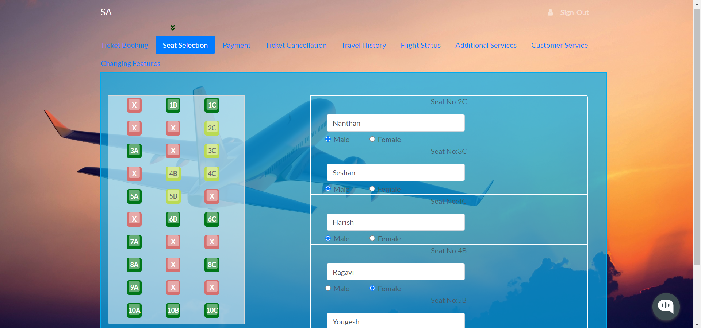

# MERN-Flight-Booking-Application


A complete flight booking application made using MERN Stack (MongoDB, Express js, React js, Node js)

The Flight ticket booking app is composed of the following Features:

### Front-End

* Sign-In & Sign-Up Pages.

* Uses Token based system, so only registered users can access the website  passport js.

* Password hashing using passport js.

* Has a profile page, which will display all information about the signed in user.

* List of cities for users to choose from (starting city & destination city). 

* Getting list of flight's of different airlines with various details.

* Seat selection page has a very user friendly environment, which also generates dynamic forms for storing data's of passengers.

* Has a Confirmation page, which gets a debit card data using react-credit-cards. This version of the application does not include handling the payment process. 

* Final page has a boarding pass displaying component, it displays all passenger data and also generates a random number as a transaction ID.

* Ticket Cancellation page will cancel the ticket which was booked.

* Also has an integrated ai chatbot

### Back-End

* Uses Express js based application for the backend process.

* Uses MongoDB atlas for storing the collections.

* Uses passport js for authenticating user and token based system.

* Uses passport js for hashing the password before sending the data to the cloud.

* This version does not support dynamic seat data being stored from cloud.


This project also demonstrates:

* a typcial React project layout structure

**Screenshots:**
Landing Page:


Signing In Page:


Flight Selection Page:


Seat Selection Page:



Payment & Confirmation Page:


Ticket Cancellation Page:


Integrated AI Chatbot:


---

## Developed With

* [Visual Studio Code](https://code.visualstudio.com/) - A source code editor developed by Microsoft for Windows, Linux and macOS. It includes support for debugging, embedded Git control, syntax highlighting, intelligent code completion, snippets, and code refactoring
* [Node.js](https://nodejs.org/en/) - Javascript runtime
* [React](https://reactjs.org/) - A javascript library for building user interfaces
* [Babel](https://babeljs.io/) - A transpiler for javascript
* [Webpack](https://webpack.js.org/) - A module bundler
* [SCSS](http://sass-lang.com/) - A css metalanguage
* [Bootstrap 4](https://getbootstrap.com/) - Bootstrap is an open source toolkit for developing with HTML, CSS, and JS
* [Axios](https://github.com/axios/axios) - Promise based HTTP client for the browser and node.js
* [Express js](http://expressjs.com/) - Express is a minimal and flexible Node.js web application framework that provides a robust set of features for web and mobile applications.
* [MongoDB atlas](https://www.mongodb.com/cloud/atlas) - MongoDB Atlas is the global cloud database service for modern applications.
* [Passport Js](http://www.passportjs.org/) - Passport is authentication middleware for Node.js. Extremely flexible and modular, Passport can be unobtrusively dropped in to any Express-based web application.
---


## Getting Started

These instructions will get you a copy of the project up and running on your local machine for development and testing purposes.

### Prerequisites

The following software is required to be installed on your system:

* Node 8.x
* Npm 3.x

Type the following commands in the terminal to verify your node and npm versions

```bash
node -v
npm -v
```

### Install

Follow the following steps to get development environment running.


* Install node modules #even though they are pre-installed run this command to check if they are up to date

   ```bash
   cd SWADESHI AIRLINES
   cd frontend
   npm install
   cd..
   cd backend
   npm install
   ```


### Starting both front end and back end servers

* Build application

  This command will start the mongodb and the front end part.

  ```bash
  cd frontend
  npm start
  cd..
  cd backend
  npm run devStart
  ```


---


